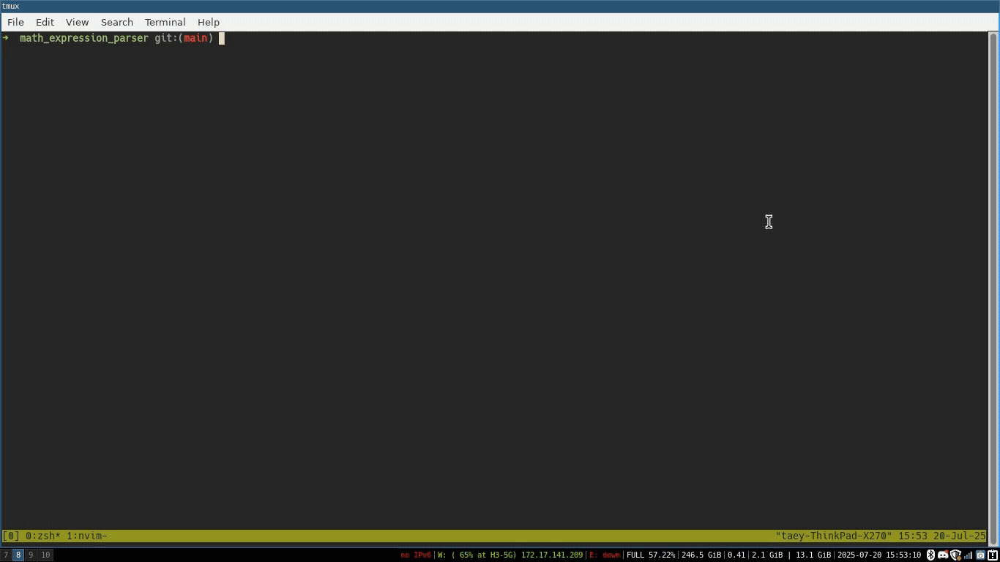

# Math Expression Parser

This project parse input string to token and evaluate the math expression result.

## Synopsis

The supported expresstion is shown as following table.

| Expresson      | Operator                      | Operand               | Example                                                    |
| -------------- | ----------------------------- | --------------------- | ---------------------------------------------------------- |
| math (E)       | + - \* / max min sqr sqrt pow | int, double, variable | (1 + 2 + sqrt(5)) \* 3 - sqr(3) \* (pow(2, 3) + max(2, 3)) |
| inequality (Q) | = != > >= < <=                | E                     | pow(2, 3) = 8                                              |
| logical (S)    | and or                        | Q                     | (pow(2, 3) = 8 or 2 > 3) and sqrt(25) = 5                  |

The following is demo of the calulator program which hard-coded variable a = int(2), b = double(1.5)

## How does it work

- Try parsing input string expression as following order logical, inequality, math. If the parsing fail try the next expression.
- During parsing create lexical stack using backtracking algorithm.
- Convert mathematical expression from infix form to postfix form which do not need paranthesis to reduce ambiguity of operator precedent.
- Create lexical tree from postfix form.
- Evaluate the result by traverse the tree in postorder.

## API

| API                        | desc                                                                                                 |
| -------------------------- | ---------------------------------------------------------------------------------------------------- |
| _global variable_          |                                                                                                      |
| lex_buffer                 | character array that hold string input, maximum size is MAX_STR_SIZE defined in parser_export.h file |
| lex_stack                  | holding lex_data that was parsed                                                                     |
| _built-in parser function_ |                                                                                                      |
| E                          | parse mathematical expression                                                                        |
| Q                          | parse inequality expression                                                                          |
| S                          | parse logical expression                                                                             |
| _parser function_          |                                                                                                      |
| cyylex                     | parse input string and create token which best match as per define in parser.l file                  |
| yyrewind                   | undo parsing from cyylex call                                                                        |
| stack_reset                | clear lexical stack                                                                                  |
| _parse status enum_        |                                                                                                      |
| PARSE_SUCCESS              |                                                                                                      |
| PARSE_ERROR                |                                                                                                      |
| _macro_                    |                                                                                                      |
| PARSE_INIT                 | declare variable that usually required for paring                                                    |
| RESTORE_CHECK_POINT        | undo all the previous parsing                                                                        |
| RETURN_PARSE_ERROR         | undo all the previous parsing then return enum PARSE_ERROR                                           |
| _converter_                |                                                                                                      |
| infix_to_postfix           | convert expression from infix form to postfix                                                        |
| _MathExprTree_             |                                                                                                      |
| MathExprTree::MathExprTree | create math expression tree from array of postfix expression                                         |
| MathExprTree::setGetVal    | set get_value function for resolving variable                                                        |
| MathExprTree::valid        | check if the operand type is compatible with operand                                                 |
| MathExprTree::eval         | evaluate the result of expression tree                                                               |

## Usage Example

See calculator.cpp file for usage example. If you want to create your custom parser see example in file alternate_a_b.c that parsing alternate ab string, sql_select_cfg.c that parse SQL select statement, or math_cfg that parse mathematical expression.
